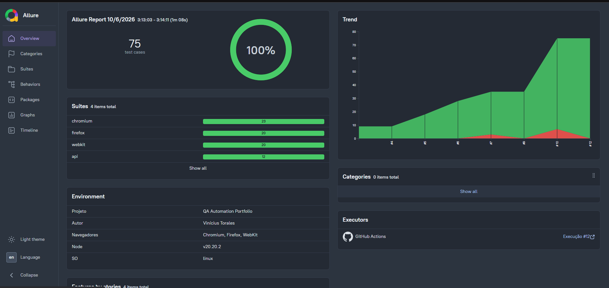
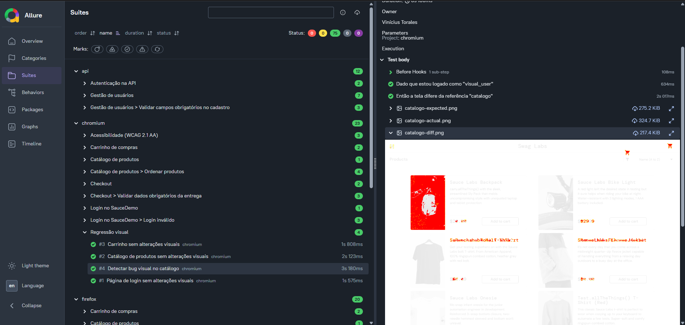
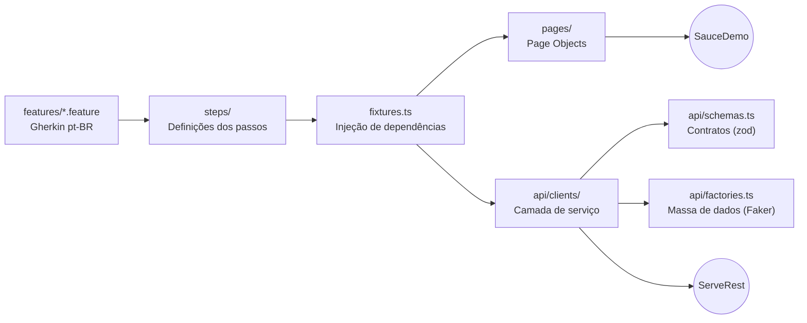
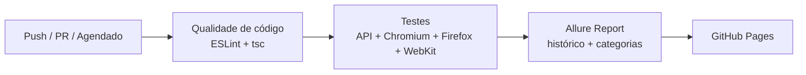
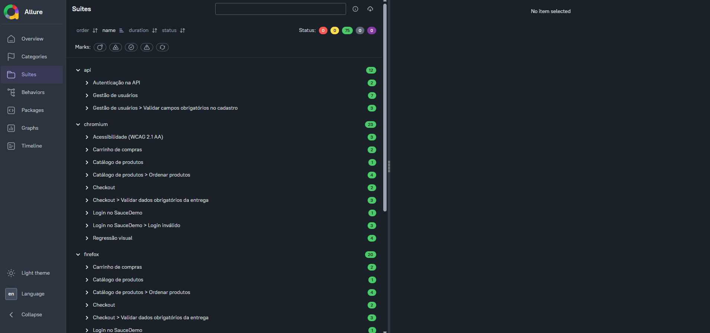

# QA Automation Portfolio

[](https://github.com/tsvini/qa-automation-portfolio/actions/workflows/tests.yml)
[](https://tsvini.github.io/qa-automation-portfolio/)


Framework de automação de testes **E2E, API, regressão visual e acessibilidade**, escrito em **TypeScript** com **Playwright + Cucumber (BDD em português)**. Roda em **3 navegadores** a cada push e diariamente, e publica um relatório Allure com histórico.

### 👉 [Ver o relatório ao vivo](https://tsvini.github.io/qa-automation-portfolio/)



---

## Em números

| | |
|---|---|
| **75** execuções por pipeline | **4** suítes (API, Chromium, Firefox, WebKit) |
| **4** tipos de teste (funcional, API, visual, acessibilidade) | **Execução diária** com histórico de tendência |
| **0** erros de lint e tipagem (verificado no CI) | **100%** dos dados de teste criados e removidos pelo próprio teste |

---

## O que é testado

| Área | Aplicação | Cobertura |
|---|---|---|
| **Interface Web** | [SauceDemo](https://www.saucedemo.com) | Login, carrinho, checkout completo, validações de formulário, ordenação de produtos |
| **API REST** | [ServeRest](https://serverest.dev) | CRUD de usuários, autenticação, validação de campos e **contrato das respostas** |
| **Regressão visual** | SauceDemo | Comparação de telas com imagens de referência, incluindo um cenário que **prova a detecção de um bug visual real** |
| **Acessibilidade** | SauceDemo | Análise WCAG 2.1 AA com axe-core e baseline de violações conhecidas |

### Detecção de bug visual

O SauceDemo tem um usuário (`visual_user`) com defeitos de layout propositais. O cenário `@deteccao` confirma que a regressão visual **pega o bug**, e o relatório mostra referência, tela atual e diferença:



---

## Arquitetura



## Pipeline



O workflow também tem uma execução manual que **gera as imagens de referência visual no Linux** e faz o commit delas automaticamente.



---

## Decisões técnicas

**Por que `playwright-bdd` e não `@cucumber/cucumber`?**
Mantém o runner nativo do Playwright, com paralelismo, fixtures, retries, trace e projetos multi-browser, e ainda permite escrever cenários em Gherkin legíveis para o negócio.

**Por que validar contrato com zod?**
Status e mensagem não pegam mudanças na *estrutura* da resposta. O schema falha se um campo some, muda de tipo ou de formato, que é o tipo de quebra que mais afeta o frontend.

**Como os testes de API ficam independentes?**
Cada cenário cria seus próprios dados com Faker, e a fixture `usuariosApi` **remove tudo que foi criado** ao final. Nenhum teste depende de outro ou de dados pré-existentes, então todos rodam em paralelo com segurança.

**Por que a API roda em um projeto separado?**
Repetir chamadas HTTP em 3 navegadores não adiciona cobertura. O projeto `api` roda sem navegador, mais rápido e sem duplicação.

**Por que as imagens de referência são geradas no CI?**
A renderização de fontes e imagens muda entre sistemas operacionais. As referências são geradas no mesmo ambiente Linux em que os testes rodam, evitando falsos positivos.

**Por que acessibilidade só no Chromium?**
O axe-core analisa o HTML da página, que é o mesmo em qualquer navegador. Rodar três vezes só repetiria a mesma análise.

**Por que um baseline de acessibilidade?**
Em produto real, raramente se corrige tudo de uma vez. Violações já conhecidas ficam documentadas em `a11y/violacoes-conhecidas.json`, e o teste **falha apenas quando uma nova violação aparece**.

**Por que categorizar falhas no Allure?**
Separar "falha de produto" de "falha de infraestrutura" mostra rapidamente se o problema está no sistema ou no ambiente.

---

## Estrutura

```
├── api/
│   ├── clients/          # Camada de serviço (UsuariosClient, LoginClient)
│   ├── factories.ts      # Geração de massa de dados com Faker
│   └── schemas.ts        # Contratos das respostas (zod)
├── features/
│   ├── api/              # Cenários de API
│   └── ui/               # Cenários de interface, visual e acessibilidade
├── pages/                # Page Objects
├── steps/                # Passos, fixtures e hooks
├── snapshots/            # Imagens de referência da regressão visual
├── a11y/                 # Baseline de violações de acessibilidade
└── .github/workflows/    # Pipeline de CI/CD
```

---

## Como rodar

```bash
npm install
npx playwright install

npm test            # todos os testes
npm run test:ui     # só interface
npm run test:api    # só API
npm run check       # lint + checagem de tipos
npm run report      # abre o relatório do Playwright
```

Localmente, os testes visuais e o WebKit ficam de fora: as referências visuais são do Linux, e o WebKit no Windows exige dependências extras. No CI, tudo roda.

---

## Autor

**Vinícius Torales**, QA Automation Engineer

[](https://www.linkedin.com/in/vinicius-torales/)